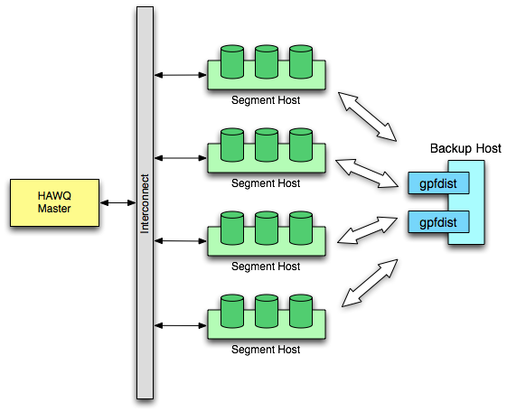
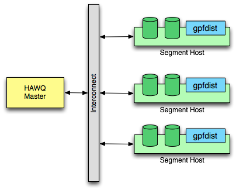

This chapter provides information on backing up and restoring databases in HAWQ system.

As an administrator, you will need to back up and restore your database. HAWQ provides three utilities to help you back up your data:

-   `gpfdist`
-   PXF
-   `pg_dump`

`gpfdist` and PXF are parallel loading and unloading tools that provide the best performance.  You can use `pg_dump`, a non-parallel utility, to migrate from PostgreSQL to HAWQ.

In addition, in some situations you should back up your raw data from ETL processes.

This section describes these three utilities, as well as raw data backup, to help you decide what fits your needs.

-   [About gpfdist and PXF](#)
    -   [Performing a Parallel Backup](#)
    -   [Restoring from a Backup](#)
    -   [Differences between gpfdist and PXF](#)
-   [About pg\_dump and pg\_restore](#)
-   [About Backing Up Raw Data](#)
-   [Selecting a Backup Strategy/Utility](#)
-   [Estimating Space Requirements](#)
-   [Using gpfdist](#)
-   [Using PXF](#)
    -   [Using PXF to Back Up the tpch Database](#)
    -   [Recovering a PXF Backup](#)

## About gpfdist and PXF <a name="usinggpfdistorpxf"></a>

You can perform a parallel backup in HAWQ using `gpfdist` or PXF to unload all data to external tables. Backup files can reside on a local file system or HDFS. To recover tables, you can load data back from external tables to the database. 

### Performing a Parallel Backup <a name="performingaparallelbackup"></a>

1.  Check the database size to ensure that the file system has enough space to save the backed up files.
2.  Use the `pg_dump` utility to dump the schema of the target database.
3.  Create a writable external table for each table to back up to that database.
4.  Load table data into the newly created external tables.

    **Note:** Put the insert statements in a single transaction to prevent problems if you perform any update operations during the backup.


### Restoring from a Backup <a name="restoringfromabackup"></a>

1.  Create a database to recover to.
2.  Recreate the schema from the schema file \(created during the `pg_dump` process\).
3.  Create a readable external table for each table in the database.
4.  Load data from the external table to the actual table.
5.  Run the `ANALYZE` command once loading is complete. This ensures that the query planner generates optimal plan based on up-to-date table statistics.

### Differences between gpfdist and PXF <a name="differencesbetweengpfdistandpxf"></a>

`gpfdist` and PXF differ in the following ways:

-   `gpfdist` stores backup files on local file system, while PXF stores files on HDFS.
-   `gpfdist` only supports plain text format, while PXF also supports binary format like AVRO and customized format.
-   `gpfdist` doesn’t support generating compressed files, while PXF supports compression \(you can specify a compression codec used in Hadoop such as `org.apache.hadoop.io.compress.GzipCodec`\).
-   Both `gpfdist` and PXF both have fast loading performance, but `gpfdist` is much faster than PXF.

## About pg\_dump and pg\_restore <a name="usingpg_dumpandpg_restore"></a>

HAWQ supports the PostgreSQL backup and restore utilities, `pg_dump` and `pg_restore`. The `pg_dump` utility creates a single, large dump file in the master host containing the data from all active segments. The `pg_restore` utility restores a HAWQ database from the archive created by `pg_dump`. In most cases, this is probably not practical, as there is most likely not enough disk space in the master host for creating a single backup file of an entire distributed database. HAWQ supports these utilities in case you are migrating data from PostgreSQL to HAWQ.

To create a backup archive for database `mydb`:

```
$ pg_dump -Ft -f mydb.tar mydb
```

To create a compressed backup using custom format and compression level 3:

```
$ pg_dump -Fc -Z3 -f mydb.dump mydb
```

To restore from an archive using `pg_restore`:

```
$ pg_restore -d new_db mydb.dump
```

## About Backing Up Raw Data <a name="aboutbackinguprawdata"></a>

Parallel backup using `gpfdist` or PXF works fine in most cases. There are a couple of situations where you cannot perform parallel backup and restore operations:

-   Performing periodically incremental backups.
-   Dumping a large data volume to external tables - this process takes a long time.

In such situations, you can back up raw data generated during ETL processes and reload it into HAWQ. This provides the flexibility to choose where you store backup files.

## Selecting a Backup Strategy/Utility <a name="estimatingthebestpractice"></a>

The table below summaries the differences between the four approaches we discussed above. 

||`gpfdist`|PXF|`pg_dump`|Raw Data Backup|
|--|---------|---|---------|---------------|
|**Parallel**|Yes|Yes|No|No|
|**Incremental Backup**|No|No|No|Yes|
|**Backup Location**|Local FS|HDFS|Local FS|Local FS, HDFS|
|**Format**|Text, CSV|Text, CSV, Custom|Text, Tar, Custom|Depends on format of row data|
|**Compression**|No|Yes|Only support custom format|Optional|
|**Scalability**|Good|Good|---|Good|
|**Performance**|Fast loading, Fast unloading|Fast loading, Normal unloading|---|Fast \(Just file copy\)|

## Estimating Space Requirements <a name="estimatingspacerequirements"></a>

Before you back up your database, ensure that you have enough space to store backup files. This section describes how to get the database size and estimate space requirements.

-   Use `hawq_toolkit` to query size of the database you want to backup. 

    ```
    mydb=# SELECT sodddatsize FROM hawq_toolkit.hawq_size_of_database WHERE sodddatname=’mydb’;
    ```

    If tables in your database are compressed, this query shows the compressed size of the database.

-   Estimate the total size of the backup files.
    -   If your database tables and backup files are both compressed, you can use the value `soddatsize` as an estimate value.
    -   If your database tables are compressed  and backup files are not, you need to multiply `soddatsize` by the compression ratio. Although this depends on the compression algorithms, you can use an empirical value such as 300%.
    -   If your back files are compressed and database tables are not, you need to divide `soddatsize` by the compression ratio.
-   Get space requirement.
    -   If you use HDFS with PXF, the space requirement is `size_of_backup_files * replication_factor`.

    -   If you use gpfdist, the space requirement for each gpfdist instance is `size_of_backup_files / num_gpfdist_instances` since table data will be evenly distributed to all `gpfdist` instances.


## Using gpfdist <a name="usinggpfdist"></a>

This section discusses `gpfdist` and shows an example of how to backup and restore HAWQ database.

`gpfdist` is HAWQ’s parallel file distribution program. It is used by readable external tables and `hawq load` to serve external table files to all HAWQ segments in parallel. It is used by writable external tables to accept output streams from HAWQ segments in parallel and write them out to a file.

To use `gpfdist`, start the `gpfdist` server program on the host where you want to store backup files. You can start multiple `gpfdist` instances on the same host or on different hosts. For each `gpfdist` instance, you specify a directory from which `gpfdist` will serve files for readable external tables or create output files for writable external tables. For example, if you have a dedicated machine for backup with two disks, you can start two `gpfdist` instances, each using one disk:



You can also run `gpfdist` instances on each segment host. During backup, table data will be evenly distributed to all `gpfdist` instances specified in the `LOCATION` clause in the `CREATE EXTERNAL TABLE` definition.



### Example <a name="example"></a>

This example of using `gpfdist` backs up and restores a 1TB `tpch` database. To do so, start two `gpfdist` instances on the backup host `sdw1` with two 1TB disks \(One disk mounts at `/data1`, another disk mounts at `/data2`\).

#### Using gpfdist to Back Up the tpch Database <a name="usinggpfdisttobackupthetpchdatabase"></a>

1.  Create backup locations and start the `gpfdist` instances.

    In this example, issuing the first command creates two folders on two different disks with the same postfix `backup/tpch_20140627`. These folders are labeled as backups of the `tpch` database on 2014-06-27. In the next two commands, the example shows two `gpfdist` instances, one using port 8080, and another using port 8081:

    ```
    sdw1$ mkdir -p /data1/gpadmin/backup/tpch_20140627 /data2/gpadmin/backup/tpch_20140627
    sdw1$ gpfdist -d /data1/gpadmin/backup/tpch_20140627 -p 8080 &
    sdw1$ gpfdist -d /data2/gpadmin/backup/tpch_20140627 -p 8081 &
    ```

2.  Save the schema for the database:

    ```
    master_host$ pg_dump --schema-only -f tpch.schema tpch
    master_host$ scp tpch.schema sdw1:/data1/gpadmin/backup/tpch_20140627
    ```

    On the HAWQ master host, use the `pg_dump` utility to save the schema of the tpch database to the file tpch.schema. Copy the schema file to the backup location to restore the database schema.

3.  Create a writable external table for each table in the database:

    ```
    master_host$ psql tpch
    tpch=# create writable external table wext_orders (like orders)
    tpch-# location ('gpfdist://sdw1:8080/orders1.csv', 'gpfdist://sdw1:8081/orders2.csv') format 'CSV';
    tpch=# create writable external table wext_lineitem (like lineitem)
    tpch-# location ('gpfdist://sdw1:8080/lineitem1.csv', 'gpfdist://sdw1:8081/lineitem2.csv') format 'CSV';
    ```

    The sample shows two tables in the `tpch` database: `orders` and `line item`. The sample shows that two corresponding external tables are created. Specify a location or each `gpfdist` instance in the `LOCATION` clause. This sample uses the CSV text format here, but you can also choose other delimited text formats. For more information, see the `CREATE EXTERNAL TABLE` SQL command.

4.  Unload data to the external tables:

    ```
    tpch=# begin;
    tpch=# insert into wext_orders select * from orders;
    tpch=# insert into wext_lineitem select * from lineitem;
    tpch=# commit;
    ```

5.  **\(Optional\)** Stop `gpfdist` servers to free ports for other processes:

    Find the progress ID and kill the process:

    ```
    sdw1$ ps -ef | grep gpfdist
    sdw1$ kill 612368; kill 612369
    ```


#### Recovering Using gpfdist <a name="torecoverusinggpfdist"></a>

1.  Restart `gpfdist` instances if they aren’t running:

    ```
    sdw1$ gpfdist -d /data1/gpadmin/backup/tpch_20140627 -p 8080 &
    sdw1$ gpfdist -d /data2/gpadmin/backup/tpch_20140627 -p 8081 &
    ```

2.  Create a new database and restore the schema:

    ```
    master_host$ createdb tpch2
    master_host$ scp sdw1:/data1/gpadmin/backup/tpch_20140627/tpch.schema .
    master_host$ psql -f tpch.schema -d tpch2
    ```

3.  Create a readable external table for each table:

    ```
    master_host$ psql tpch2

    tpch2=# create external table rext_orders (like orders) location ('gpfdist://sdw1:8080/orders1.csv', 'gpfdist://sdw1:8081/orders2.csv') format 'CSV';
    tpch2=# create external table rext_lineitem (like lineitem) location ('gpfdist://sdw1:8080/lineitem1.csv', 'gpfdist://sdw1:8081/lineitem2.csv') format 'CSV';
    ```

    **Note:** The location clause is the same as the writable external table above.

4.  Load data back from external tables:

    ```
    tpch2=# insert into orders select * from rext_orders;
    tpch2=# insert into lineitem select * from rext_lineitem;
    ```

5.  Run the `ANALYZE` command after data loading:

    ```
    tpch2=# analyze;
    ```


### Troubleshooting gpfdist <a name="troubleshootinggpfdist"></a>

Keep in mind that `gpfdist` is accessed at runtime by the segment instances. Therefore, you must ensure that the HAWQ segment hosts have network access to gpfdist. Since the `gpfdist` program is a  web server, to test connectivity you can run the following command from each host in your HAWQ array \(segments and master\):

```
$ wget http://gpfdist_hostname:port/filename
```

Also, make sure that your `CREATE EXTERNAL TABLE` definition has the correct host name, port, and file names for `gpfdist`. The file names and paths specified should be relative to the directory where gpfdist is serving files \(the directory path used when you started the `gpfdist` program\). See “Defining External Tables - Examples”.

## Using PXF <a name="usingpxf"></a>

Pivotal Extension Framework \(PXF\) is an extensible framework that allows HAWQ to query external system data. The details of how to install and use PXF can be found in *PXF Installation and Administration*.

### Using PXF to Back Up the tpch Database <a name="usingpxftobackupthetpchdatabase"></a>

1.  Create a folder on HDFS for this backup:

    ```
    master_host$ hdfs dfs -mkdir -p /backup/tpch-2014-06-27
    ```

2.  Dump the database schema using `pg_dump` and store the schema file in a backup folder:

    ```
    master_host$ pg_dump --schema-only -f tpch.schema tpch
    master_host$ hdfs dfs -copyFromLocal tpch.schema /backup/tpch-2014-06-27
    ```

3.  Create a writable external table for each table in the database:

    ```
    master_host$ psql tpch

    tpch=# CREATE WRITABLE EXTERNAL TABLE wext_orders (LIKE orders)
    tpch-# LOCATION ('pxf://namenode_host:51200/backup/tpch-2014-06-27/orders'
    tpch-#           '?Profile=HdfsTextSimple'
    tpch-#           '&COMPRESSION_CODEC=org.apache.hadoop.io.compress.SnappyCodec'
    tpch-#          )
    tpch-# FORMAT 'TEXT';

    tpch=# CREATE WRITABLE EXTERNAL TABLE wext_lineitem (LIKE lineitem)
    tpch-# LOCATION ('pxf://namenode_host:51200/backup/tpch-2014-06-27/lineitem'
    tpch-#           '?Profile=HdfsTextSimple'
    tpch-#           '&COMPRESSION_CODEC=org.apache.hadoop.io.compress.SnappyCodec')
    tpch-# FORMAT 'TEXT';
    ```

    Here, all backup files for the `orders` table go in the /backup/tpch-2014-06-27/orders folder, all backup files for the `lineitem` table go in /backup/tpch-2014-06-27/lineitem folder. We use snappy compression to save disk space.

4.  Unload the data to external tables:

    ```
    tpch=# BEGIN;
    tpch=# INSERT INTO wext_orders SELECT * FROM orders;
    tpch=# INSERT INTO wext_lineitem SELECT * FROM lineitem;
    tpch=# COMMIT;
    ```

5.  **\(Optional\)** Change the HDFS file replication factor for the backup folder. HDFS replicates each block into three blocks by default for reliability. You can decrease this number for your backup files if you need to:

    ```
    master_host$ hdfs dfs -setrep 2 /backup/tpch-2014-06-27
    ```

    **Note:** This only changes the replication factor for existing files; new files will still use the default replication factor.


### Recovering a PXF Backup <a name="torecoverfromapxfbackup"></a>

1.  Create a new database and restore the schema:

    ```
    master_host$ createdb tpch2
    master_host$ hdfs dfs -copyToLocal /backup/tpch-2014-06-27/tpch.schema .
    master_host$ psql -f tpch.schema -d tpch2
    ```

2.  Create a readable external table for each table to restore:

    ```
    master_host$ psql tpch2
    tpch2=# CREATE EXTERNAL TABLE rext_orders (LIKE orders)
    tpch2-# LOCATION ('pxf://namenode_host:51200/backup/tpch-2014-06-27/orders?Profile=HdfsTextSimple')
    tpch2-# FORMAT 'TEXT';
    tpch2=# CREATE EXTERNAL TABLE rext_lineitem (LIKE lineitem)
    tpch2-# LOCATION ('pxf://namenode_host:51200/backup/tpch-2014-06-27/lineitem?Profile=HdfsTextSimple')
    tpch2-# FORMAT 'TEXT';
    ```

    The location clause is almost the same as above, except you don’t have to specify the `COMPRESSION_CODEC` because PXF will automatically detect it.

3.  Load data back from external tables:

    ```
    tpch2=# INSERT INTO ORDERS SELECT * FROM rext_orders;
    tpch2=# INSERT INTO LINEITEM SELECT * FROM rext_lineitem;
    ```

4.  Run `ANALYZE` after data loading:

    ```
    tpch2=# ANALYZE;
    ```
