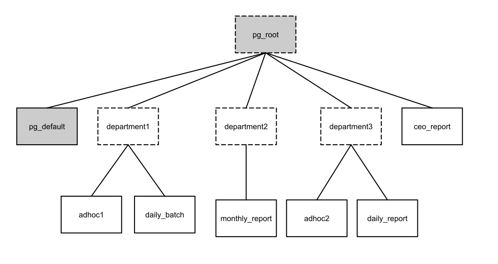

This section describes how administrators can define and work with resource queues in order to allocate resource usage within HAWQ. By designing hierarchical resource queues, system administrators can balance system resources to queries as needed.

## HAWQ Resource Queues

Resource queues are the main tool for managing the degree of concurrency in a HAWQ system. Resource queues are database objects that you create with the CREATE RESOURCE QUEUE SQL statement. You can use them to manage the number of active queries that may execute concurrently, and the maximum amount of memory and CPU usage each type of query is allocated. Resource queues can also guard against queries that would consume too many resources and degrade overall system performance.

Internally, HAWQ manages its resources dynamically based on a system of hierarchical resource queues. HAWQ uses resource queues to allocate resources efficiently to concurrently running queries. Resource queues are organized as a n-ary tree, as depicted in the diagram below.



When HAWQ is initialized, there is always one queue named `pg_root` at the root of the tree and one queue named `pg_default`. If YARN is configured, HAWQ's resource manager automatically fetches the capacity of this root queue from the global resource manager. When you create a new resource queue, you must specify a parent queue. This forces all resource queues to organize into a tree.

When a query comes in, after query parsing and semantic analysis, the optimizer coordinates with HAWQ resource manager on the resource usage for the query and get an optimized plan given the resources available for the query. The resource allocation for each query is sent with the plan together to the segments. Consequently, each query executor \(QE\) knows the resource quota for the current query and enforces the resource consumption during the whole execution. When query execution finishes or is cancelled. the resource is returned to the HAWQ resource manager.

**About Branch Queues and Leaf Queues**

In this hierarchical resource queue tree depicted in the diagram, there are branch queues \(rectangles outlined in dashed lines\) and leaf queues \(rectangles drawn with solid lines\). Only leaf queues can be associated with roles and accept queries.

**Query resource allocation policy**

The HAWQ resource manager follows several principles when allocating resources to queries:

-   Resources are allocated only to queues that have running or queued queries.
-   When multiple queues are busy, the resource manager balances resources among queues based on resource queue capacities.
-   In one resource queue, when multiple queries are waiting for resources, resources are distributed evenly to each query in a best effort manner.

**Enforcing Limits on Resources**

You can configure HAWQ to enforce limits on resource usage by setting memory and CPU usage limits on both segments and resource queues. See [Configuring Segment Resource Capacity](ConfigureResourceManagement.html) and [Creating Resource Queues](ResourceQueues.html).

For a high-level overview of how resource management works in HAWQ, see [Managing Resources](HAWQResourceManagement.html).

## Setting the Maximum Number of Resource Queues <a id="topic_dyy_pfp_15"></a>

You can configure the maximum number of resource queues allowed in your HAWQ cluster.

By default, the maximum number of resource queues that you can create in HAWQ is 128.

You can configure this property in `hawq-site.xml`. The new maximum takes effect when HAWQ restarts. For example, the configuration below sets this value to 50.

```
<property>
   <name>hawq_rm_nresqueue_limit</name>
   <value>50</value>
</property>
```

The minimum value that can be configured is 3, and the maximum is 1024.

To check the currently configured limit, you can execute the following command:

```
postgres=# show hawq_rm_nresqueue_limit;

 hawq_rm_nresqueue_limit
----------------------------------------------
128
(1 row)
```

## Creating Resource Queues <a id="topic_p4l_dls_zt"></a>

Use CREATE RESOURCE QUEUE to create a new resource queue. Only a superuser can run this DDL statement.

Creating a resource queue involves giving it a name, a parent, setting the CPU and memory limits for the queue, and optionally a limit to the number of active statements on the resource queue. See [CREATE RESOURCE QUEUE](/200/hawq/reference/sql/CREATE-RESOURCE-QUEUE.html).

**Note:** You can only associate roles and queries with leaf-level resource queues. Leaf-level resource queues are resource queues that do not have any children.

### Examples

Create a resource queue as a child of `pg_root` with an active query limit of 20 and memory and core limits of 50%:

```
CREATE RESOURCE QUEUE myqueue WITH (PARENT='pg_root', ACTIVE_STATEMENTS=20,
MEMORY_LIMIT_CLUSTER=50%, CORE_LIMIT_CLUSTER=50%);
```

Create a resource queue as a child of pg\_root with memory and CPU limits and a resource overcommit factor:

```
CREATE RESOURCE QUEUE test_queue_1 WITH (PARENT='pg_root',
MEMORY_LIMIT_CLUSTER=50%, CORE_LIMIT_CLUSTER=50%, RESOURCE_OVERCOMMIT_FACTOR=2);
```

## Altering Resource Queues <a id="topic_e1b_2ls_zt"></a>

Use ALTER RESOURCE QUEUE to modify an existing resource queue. Only a superuser can run this DDL statement.

The ALTER RESOURCE QUEUE statement allows you to modify resource limits and the number of active statements allowed in the queue. You cannot change the parent queue of an existing resource queue, and you are subject to the same constraints that apply to the creation of resource queues.

You can modify an existing resource queue even when it is active or when one of its descendents is active. All queued resource requsts are adjusted based on the modifications to the resource queue.

However, when you alter a resource queue, queued resource requests may encounter some conflicts. For example, a resource deadlock can occur or some requests cannot be satisfied based on the newly modified resource queue capacity.

To prevent conflicts, HAWQ cancels by default all resource requests that are in conflict with the new resource queue definition. This behavior is controlled by the `hawq_rm_force_alterqueue_cancel_queued_request` server configuration parameter, which is by default set to true \(`on`\). If you set the server configuration parameter `hawq_rm_force_alterqueue_cancel_queued_request` to false, the actions specified in ALTER RESOURCE QUEUE are canceled if the resource manager finds at least one resource request that is in conflict with the new resource definitions supplied in the altering command.

For more information, see [ALTER RESOURCE QUEUE](/200/hawq/reference/sql/ALTER-RESOURCE-QUEUE.html).

**Note:** To change the roles \(users\) assigned to a resource queue, use the ALTER ROLE command.

### Examples

Change the memory and core limit of a resource queue:

```
ALTER RESOURCE QUEUE test_queue_1 WITH (MEMORY_LIMIT_CLUSTER=40%,
CORE_LIMIT_CLUSTER=40%);
```

Change the active statements maximum for the resource queue:

```
ALTER RESOURCE QUEUE test_queue_1 WITH (ACTIVE_STATEMENTS=50);
```

## Dropping Resource Queues <a id="topic_hbp_fls_zt"></a>

Use DROP RESOURCE QUEUE to remove an existing resource queue.

DROP RESOURCE QUEUE drops an existing resource queue. Only a superuser can run this DDL statement when the queue is not busy. You cannot drop a resource queue that has at least one child resource queue or a role assigned to it.

The default resource queues `pg_root` and `pg_default` cannot be dropped.

### Examples

Remove a role from a resource queue \(and move the role to the default resource queue, `pg_default`\):

```
ALTER ROLE bob RESOURCE QUEUE NONE;
```

Remove the resource queue named `adhoc`:

```
DROP RESOURCE QUEUE adhoc;
```

## Checking Existing Resource Queues <a id="topic_lqy_gls_zt"></a>

The HAWQ catalog table `pg_resqueue` saves all existing resource queues.

The following example shows the data selected from `pg_resqueue`.

```
postgres=# SELECT rsqname,parentoid,activestats,memorylimit,corelimit,resovercommit,
allocpolicy,vsegresourcequota,nvsegupperlimit,nvseglowerlimit,nvsegupperlimitperseg,nvseglowerlimitperseg
FROM pg_resqueue WHERE rsqname='test_queue_1';

   rsqname    | parentoid | activestats | memorylimit | corelimit | resovercommit | allocpolicy | vsegresourcequota | nvsegupperlimit | nvseglowerlimit |nvsegupperlimitperseg  | nvseglowerlimitperseg
--------------+-----------+-------------+-------------+-----------+---------------+-------------+-------------------+-----------------+-----------------+-----------------------+-----------------------
 test_queue_1 |      9800 |         100 | 50%         | 50%       |             2 | even        | mem:128mb         | 0               | 0               | 0                     |1
```

The query displays all the attributes and their values of the selected resource queue. See [CREATE RESOURCE QUEUE](/200/hawq/reference/sql/CREATE-RESOURCE-QUEUE.html) for a description of these attributes.

You can also check the runtime status of existing resource queues by querying the `pg_resqueue_status` view:

```
postgres=# select * from pg_resqueue_status;

  rsqname   | segmem | segcore  | segsize | segsizemax | inusemem | inusecore | rsqholders | rsqwaiters | paused
------------+--------+----------+---------+------------+----------+-----------+------------+------------+--------
 pg_root    | 128    | 0.125000 | 64      | 64         | 0        | 0.000000  | 0          | 0          | F
 pg_default | 128    | 0.125000 | 32      | 64         | 0        | 0.000000  | 0          | 0          | F(2 rows)
```

The query returns the following pieces of data about the resource queue's runtime status:

|Resource Queue Runtime|Description|
|----------------------|-----------|
|rsqname|HAWQ resource queue name|
|segmem|Virtual segment memory quota in MB|
|segcore|Virtual segment vcore quota|
|segsize|Number of virtual segments the resource queue can dispatch for query execution|
|segsizemax|Maximum number of virtual segments the resource queue can dispatch for query execution when overcommit the other queues’ resource quota|
|inusemem|Accumulated memory in use in MB by current running statements|
|inusecore|Accumulated vcore in use by current running statements|
|rsqholders|The total number of concurrent running statements|
|rsqwaiters|Total number of queuing statements|
|paused|Indicates whether the resource queue is temporarily paused due to no resource status changes. ‘F’ means false, ‘T’ means true, ‘R’ means maybe the resource queue has encountered a resource fragmentation problem|

## Assigning Roles to Resource Queues <a id="topic_scr_3ls_zt"></a>

By default, a role is assigned to `pg_default` resource queue. Assigning a role to a branch queue is not allowed.

The following are some examples of creating and assigning a role to a resource queue:

```
CREATE ROLE rmtest1 WITH LOGIN RESOURCE QUEUE pg_default;

ALTER ROLE rmtest1 RESOURCE QUEUE test_queue_1;
```

## Analyzing Resource Manager Status <a id="topic_zrh_pkc_f5"></a>

You can use several queries to force the resource manager to dump more details about active resource context status, current resource queue status, and HAWQ segment status.

### Connection Track Status

Any query execution requiring resource allocation from HAWQ resource manager has one connection track instance tracking the whole resource usage lifecycle. You can find all resource requests and allocated resources in this dump.

The following is an example query to obtain connection track status:

```
postgres=# select * from dump_resource_manager_status(1);
                              dump_resource_manager_status
----------------------------------------------------------------------------------------
 Dump resource manager connection track status to /tmp/resource_manager_conntrack_status
(1 row)
```

The following output is an example of resource context \(connection track\) status.

```
Number of free connection ids : 65535
Number of connection tracks having requests to handle : 0
Number of connection tracks having responses to send : 0SOCK(client=192.168.2.100:37396:time=2015-11-15-20:54:35.379006),
CONN(id=44:user=role_2:queue=queue2:prog=3:time=2015-11-15-20:54:35.378631:lastact=2015-11-15-20:54:35.378631:
headqueue=2015-11-15-20:54:35.378631),ALLOC(session=89:resource=(1024 MB, 0.250000 CORE)x(1:min=1:act=-1):
slicesize=5:io bytes size=3905568:vseg limit per seg=8:vseg limit per query=1000:fixsegsize=1:reqtime=2015-11-15-20:54:35.379144:
alloctime=2015-11-15-20:54:35.379144:stmt=128 MB x 0),LOC(size=3:host(sdw3:3905568):host(sdw2:3905568):
host(sdw1:3905568)),RESOURCE(hostsize=0),MSG(id=259:size=96:contsize=96:recvtime=1969-12-31-16:00:00.0,
client=192.168.2.100:37396),COMMSTAT(fd=5:readbuffer=0:writebuffer=0
buffers:toclose=false:forceclose=false)
```

|Output Field|Description|
|------------|-----------|
|`Number of free connection ids`|Provides connection track id resource. HAWQ resource manager supports maximum 65536 live connection track instances.|
|`Number of connection tracks having requests to handle`|Counts the number of requests accepted by resource manager but not processed yet.|
|`Number of connection tracks having responses to send`|Counts the number of responses generated by resource manager but not sent out yet.|
|`SOCK`|Provides the request socket connection information.|
|`CONN`|Provides the information about the role name, target queue, current status of the request:<br/><br/>`prog=1` means the connection is established<br/><br/>   `prog=2` means the connection is registered by role id<br/><br/>`prog=3` means the connection is waiting for resource in the target queue<br/><br/>`prog=4` means the resource has been allocated to this connection<br/><br/>`prog>5` means some failure or abnormal statuses|
|`ALLOC`|Provides session id information, resource expectation, session level resource limits, statement level resource settings, estimated query workload by slice number, and so on.|
|`LOC`|Provides query scan HDFS data locality information.|
|`RESOURCE`|Provides information on the already allocated resource.|
|`MSG`|Provides the latest received message information.|
|`COMMSTAT`|Shows current socket communication buffer status.|

### Resource Queue Status

You can get more details of the status of resource queues.

Besides the information provided in pg\_resqueue\_status, you can also get YARN resource queue maximum capacity report, total number of HAWQ resource queues, and HAWQ resource queues’ derived resource capacities.

The following is a query to obtain resource queue status:

```
postgres=# select * from dump_resource_manager_status(2);
                            dump_resource_manager_status
-------------------------------------------------------------------------------------
 Dump resource manager resource queue status to /tmp/resource_manager_resqueue_status
(1 row)
```

The possible output of resource queue status is shown as below.

```
Maximum capacity of queue in global resource manager cluster 1.000000

Number of resource queues : 4

QUEUE(name=pg_root:parent=NULL:children=3:busy=0:paused=0),
REQ(conn=0:request=0:running=0),
SEGCAP(ratio=4096:ratioidx=-1:segmem=128MB:segcore=0.031250:segnum=1536:segnummax=1536),
QUECAP(memmax=196608:coremax=48.000000:memper=100.000000:mempermax=100.000000:coreper=100.000000:corepermax=100.000000),
QUEUSE(alloc=(0 MB,0.000000 CORE):request=(0 MB,0.000000 CORE):inuse=(0 MB,0.000000 CORE))

QUEUE(name=pg_default:parent=pg_root:children=0:busy=0:paused=0),
REQ(conn=0:request=0:running=0),
SEGCAP(ratio=4096:ratioidx=-1:segmem=1024MB:segcore=0.250000:segnum=38:segnummax=76),
QUECAP(memmax=78643:coremax=19.000000:memper=20.000000:mempermax=40.000000:coreper=20.000000:corepermax=40.000000),
QUEUSE(alloc=(0 MB,0.000000 CORE):request=(0 MB,0.000000 CORE):inuse=(0 MB,0.000000 CORE))
```

|Output Field|Description|
|------------|-----------|
|`Maximum capacity of queue in global resource manager cluster`|YARN maximum capacity report for the resource queue.|
|`Number of resource queues`|Total number of HAWQ resource queues.|
|`QUEUE`|Provides basic structural information about the resource queue and whether it is busy dispatching resources to some queries.|
|`REQ`|Provides concurrency counter and the status of waiting queues.|
|`SEGCAP`|Provides the virtual segment resource quota and dispatchable number of virtual segments.|
|`QUECAP`|Provides derived resource queue capacity and actual percentage of the cluster resource a queue can use.|
|`QUEUSE`|Provides information about queue resource usage.|

### HAWQ Segment Status

Use the following query to obtain the status of a HAWQ segment.

```
postgres=# select * from dump_resource_manager_status(3);
                           dump_resource_manager_status
-----------------------------------------------------------------------------------
 Dump resource manager resource pool status to /tmp/resource_manager_respool_status
(1 row)
```

The following output shows the status of a HAWQ segment status. This example describes a host named `sdw1` having resource capacity 64GB memory and 16 vcore. It now has 64GB available resource ready for use and 16 containers are held.

```
HOST_ID(id=0:hostname:sdw1)
HOST_INFO(FTSTotalMemoryMB=65536:FTSTotalCore=16:GRMTotalMemoryMB=0:GRMTotalCore=0)
HOST_AVAILABLITY(HAWQAvailable=true:GLOBAvailable=false)
HOST_RESOURCE(AllocatedMemory=65536:AllocatedCores=16.000000:AvailableMemory=65536:
AvailableCores=16.000000:IOBytesWorkload=0:SliceWorkload=0:LastUpdateTime=1447661681125637:
RUAlivePending=false)
HOST_RESOURCE_CONTAINERSET(ratio=4096:AllocatedMemory=65536:AvailableMemory=65536:
AllocatedCore=16.000000:AvailableCore:16.000000)
        RESOURCE_CONTAINER(ID=0:MemoryMB=4096:Core=1:Life=0:HostName=sdw1)
        RESOURCE_CONTAINER(ID=1:MemoryMB=4096:Core=1:Life=0:HostName=sdw1)
        RESOURCE_CONTAINER(ID=2:MemoryMB=4096:Core=1:Life=0:HostName=sdw1)
        RESOURCE_CONTAINER(ID=3:MemoryMB=4096:Core=1:Life=0:HostName=sdw1)
        RESOURCE_CONTAINER(ID=4:MemoryMB=4096:Core=1:Life=0:HostName=sdw1)
        RESOURCE_CONTAINER(ID=5:MemoryMB=4096:Core=1:Life=0:HostName=sdw1)
        RESOURCE_CONTAINER(ID=6:MemoryMB=4096:Core=1:Life=0:HostName=sdw1)
        RESOURCE_CONTAINER(ID=7:MemoryMB=4096:Core=1:Life=0:HostName=sdw1)
        RESOURCE_CONTAINER(ID=8:MemoryMB=4096:Core=1:Life=0:HostName=sdw1)
        RESOURCE_CONTAINER(ID=9:MemoryMB=4096:Core=1:Life=0:HostName=sdw1)
        RESOURCE_CONTAINER(ID=10:MemoryMB=4096:Core=1:Life=0:HostName=sdw1)
        RESOURCE_CONTAINER(ID=11:MemoryMB=4096:Core=1:Life=0:HostName=sdw1)
        RESOURCE_CONTAINER(ID=12:MemoryMB=4096:Core=1:Life=0:HostName=sdw1)
        RESOURCE_CONTAINER(ID=13:MemoryMB=4096:Core=1:Life=0:HostName=sdw1)
        RESOURCE_CONTAINER(ID=14:MemoryMB=4096:Core=1:Life=0:HostName=sdw1)
        RESOURCE_CONTAINER(ID=15:MemoryMB=4096:Core=1:Life=0:HostName=sdw1)
```

|Output Field|Description|
|------------|-----------|
|`HOST_ID`|Provides the recognized segment name and internal id.|
|`HOST_INFO`|Provides the configured segment resource capacities. GRMTotalMemoryMB and GRMTotalCore shows the limits reported by YARN, FTSTotalMemoryMB and FTSTotalCore show the limits configured in HAWQ.|
|`HOST_AVAILABILITY`|Shows if the segment is available from HAWQ fault tolerance service \(FTS\) view or YARN view.|
|`HOST_RESOURCE`|Shows current allocated and available resource. Estimated workload counters are also shown here.|
|`HOST_RESOURCE_CONTAINERSET`|Shows each held containers.|
